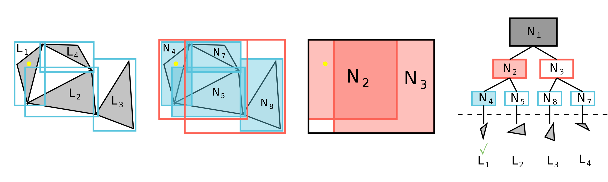

Acceleration Data Structures
============================

Ray tracing against a mesh becomes expensive if every ray is tested against every
primitive. A model with many triangles, tetrahedra, or other mesh elements needs
an acceleration structure so most primitives can be rejected before the more
expensive ray-primitive intersection tests are performed.

XDG relies primarily on :term:`BVH`-based acceleration structures. In keeping
with the XDG design philosophy (:ref:`design_philosophy`), these structures are
built and traversed by the selected ray tracing backend. On CPUs, XDG currently
relies on the :term:`Embree` ray tracing kernels for BVH construction and
traversal.

Axis-Aligned Bounding Boxes
---------------------------

The basic building block is an axis-aligned bounding box (AABB). An AABB is a
conservative box around a primitive or group of primitives, aligned with the
coordinate axes. Ray-box intersection is much cheaper than ray-primitive
intersection, so a ray that misses an AABB can skip everything inside it.

.. figure:: ../assets/AABB.png
   :alt: Axis-aligned bounding box around a primitive
   :align: center
   :width: 45%

   Axis-aligned bounding boxes provide simple bounding volumes for ray
   intersection tests.

Bottom-Level Acceleration Structures
------------------------------------

A :term:`BLAS` is the lower-level acceleration structure built over the
primitives of one piece of geometry. In practice, this is commonly a BVH:
leaf nodes reference primitives, while internal nodes store AABBs that enclose
their child nodes. Traversal starts at the root of the tree and only descends
into child boxes that the ray intersects. The diagram below shows a simple BLAS
with AABBs at each node and triangles at the leaves:

   A BLAS partitions geometry into a hierarchy of bounding volumes.

Top-Level Acceleration Structures
---------------------------------

Many ray tracing libraries use a two-level acceleration structure made from a
:term:`TLAS` and one or more BLAS instances. The TLAS is built over higher-level
geometry instances rather than individual mesh primitives. A ray first traverses
the TLAS to reject whole pieces of geometry, then traverses only the relevant
BLASes to test against individual primitives.

.. figure:: ../assets/TLAS-krhonos.png
   :alt: Khronos top-level acceleration structure diagram
   :align: center
   :width: 100%

   Khronos illustration of a TLAS over lower-level BLAS instances.

Backend Terminology Mapping
---------------------------

The BLAS/TLAS terminology is useful for describing the common two-level
acceleration structure pattern, but XDG does not require every backend to expose
objects with those exact names. In Embree, the exposed objects are
``RTCGeometry`` and ``RTCScene``; Embree builds the concrete acceleration
structures internally when those objects are committed. Because the current
Embree backend does not use Embree instance geometries, its mapping should be
read as BLAS-like and TLAS-like rather than as explicit BLAS/TLAS objects. GPRT
maps more directly onto the BLAS/TLAS terminology.

For :term:`surface tracking`, XDG traces against the boundary surfaces of a
topological volume where each surface has its own BLAS-like structure:

.. list-table:: Surface tracking acceleration structure mapping
   :header-rows: 1
   :widths: 24 38 38

   * - Concept
     - Embree
     - GPRT
   * - **Top level**
     - TLAS-like object in ``RTCScene``
     - TLAS ``GPRTAccel`` created with ``gprtInstanceAccelCreate``
   * - **Bottom level**
     - BLAS-like object in ``RTCGeometry`` with user triangle primitives
     - BLAS ``GPRTAccel`` created with ``gprtAABBAccelCreate`` for a
       ``GPRTGeom``
   * - **Instance**
     - Not used currently; geometries are attached directly to scenes
     - ``gprt::Instance`` created from the surface BLAS
   * - **Topological volume**
     - Per-volume ``RTCScene`` containing the boundary-surface geometries
     - TLAS over the BLAS instances for the volume's boundary surfaces
   * - **Topological surface**
     - Cached ``RTCGeometry`` over the surface's triangle faces
     - ``GPRTGeom`` and BLAS over the surface's triangle faces

For :term:`volume tracking`, XDG traces against the volumetric elements inside a
topological volume where each volume has exactly one BLAS-like structure containing 
all of its elements. The more explicit BLAS/TLAS terminology is less applicable in this 
case, but the mapping is shown below for completeness:

.. list-table:: Volume tracking acceleration structure mapping
   :header-rows: 1
   :widths: 24 38 38

   * - Concept
     - Embree
     - GPRT
   * - **Top level**
     - TLAS-like object in ``RTCScene`` for the volume's element tree
     - Not implemented currently
   * - **Bottom level**
     - BLAS-like object in ``RTCGeometry`` with user volumetric-element primitives
     - Not implemented currently
   * - **Instance**
     - Not used currently
     - Not implemented currently
   * - **Topological volume**
     - Per-volume ``RTCScene`` containing the volume-element geometry
     - Planned analog would be an acceleration structure over volume elements
   * - **Topological surface**
     - Not the traversal object; intersections are with volumetric elements
     - Not used for element traversal

Mixed Precision Ray Tracing
===========================

The paper "Hardware-Accelerated Ray Tracing of CAD-Based Geometry for Monte
Carlo Radiation Transport" discusses the use of mixed-precision algorithms
to efficiently handle complex CAD-based geometries in Monte Carlo radiation
transport simulations. The key contributions of the paper include leveraging
modern ray tracing kernels to significantly speed up the ray tracing process,
which is critical for handling the high computational demands of Monte Carlo
methods [1]_.

By integrating the techniques discussed in the paper, XDG achieves
faster BVH construction and traversal, leading to more efficient simulations.
This is particularly beneficial for applications involving complex geometries
and large-scale simulations, where traditional CPU-based methods may fall short
in terms of performance.

.. [1] P. Shriwise, P. Wilson, A. Davis, P. Romano, "Hardware-Accelerated Ray
       Tracing of CAD-Based Geometry for Monte Carlo Radiation Transport," in
       *IEEE Computing in Science and Engineering*, vol. 24, no. 2, pp. 52-61,
       February 2022, doi: 10.1109/MCSE.2022.3154656.

GPU-Accelerated Ray Tracing
===========================

Ray tracing as a technique is highly parallelizable and has been extensively
optimized for GPU architectures in the context of graphics rendering. As a
result, there is a rich ecosystem of GPU-accelerated software and even
hardware support (see :term:`RT hardware acceleration`) for ray tracing
operations. Historically, these capabilities have focused on single-precision
support and have not typically been adopted in the scientific computing
community.

XDG is intended to support GPU acceleration and provide an interface for
leveraging GPU-accelerated ray tracing in scientific computing applications.
An explicit focus is being placed on vendor-agnostic GPU support to ensure that
XDG can be used across a wide range of hardware platforms. Currently, initial
scoping of the GPU API is underway with work being done to support :term:`GPRT`
(General Purpose Ray Tracing Toolkit), a Vulkan-based GPU-only ray tracing
library that is vendor-agnostic and built around the Vulkan API. Other GPU ray
tracing libraries will also be explored in the future, with the eventual goal of
providing complete feature parity between CPU and GPU backends of XDG.
