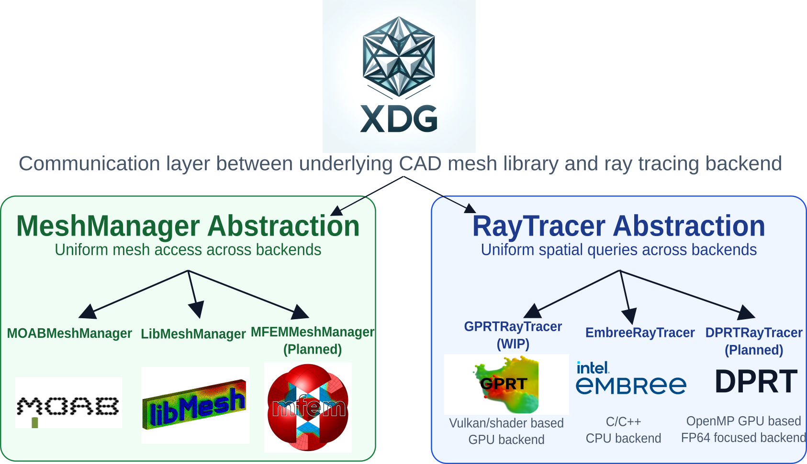
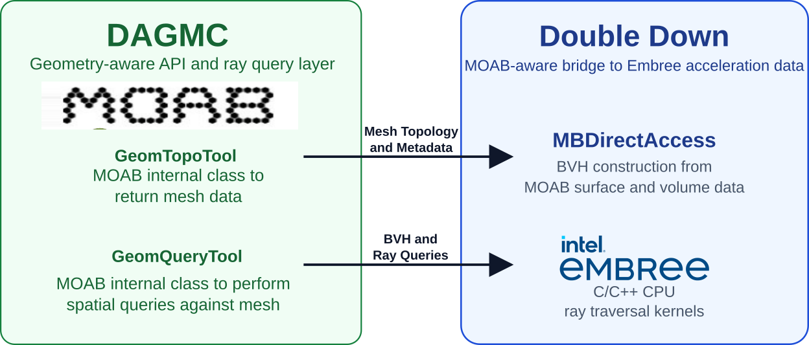

.. _design_philosophy:

XDG Design Philosophy
=====================

The design of XDG has been largely influenced by the history of DAGMC's design
and the places where it was found to be less flexible and extensible as the 
library evolved. The XDG architecture diagram below shows how those 
responsibilities are organized in the modern library:

   High-level XDG design architecture diagram

The primary design goals of XDG are centered on the following core ideas:

- **Mesh Library Abstraction**: all mesh-based operations in XDG are
  abstracted through a common interface, the ``MeshManagerInterface``. This
  allows for the use of multiple mesh libraries without changing the core
  XDG codebase. A minimal implementation of the interface can be found in
  the ``mesh_mock.h`` file in the test suite and is only ~100 lines long.

- **Separation of Mesh and RayTracing Implementations**: XDG is designed to
  separate the concerns of mesh interfaces and ray tracing. Mesh libraries
  often implement their own acceleration data structures and ray tracing
  algorithms. XDG is designed to build on top of these libraries and provide
  a common interface for ray tracing operations that works for all of the
  supported mesh libraries (see :ref:`xdg_intro`). This makes the library
  agile and able to leverage the strengths of multiple mesh libraries along
  with modern ray tracing algorithms.

- **Ray Tracing Interface Abstraction**: all ray tracing operations in XDG are
  abstracted through a common interface, the ``RayTracingInterface``. This
  allows for the use of multiple ray tracing libraries without changing the
  core XDG codebase. This is important for one of XDG's primary goals: to
  support ray tracing on both CPUs and GPUs in a single binary.

For historical context, DAGMC's design and its interaction with the subsequent
:term:`double-down` extension help explain why XDG adopts these abstractions.
That earlier design was more tightly coupled to :term:`MOAB`, and the ray tracing
path through :term:`double-down` was less extensible being a direct interface only
to the :term:`Embree` ray tracing kernels. The older DAGMC/double-down layout is 
also shown below for comparison:

   Historical DAGMC design architecture with the double-down ray tracing extension
